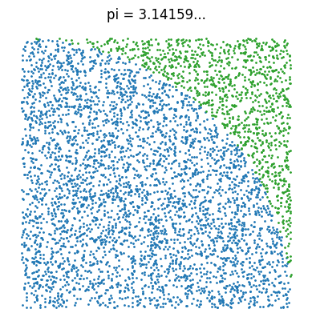
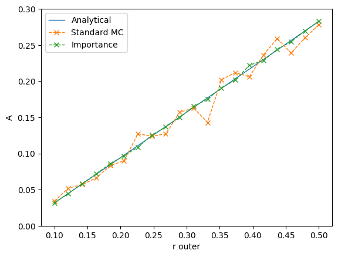

# Neural Monte Carlo Integration
## Overview
* Monte Carlo Integration is unbiased, but its convergence is quite slow.
* Using a neural network, we can speed up the integration by more than two orders of magnitude.
* A toy problem is solved to illustrate the efficiency of this method.<br>
<br>


## Monte Carlo Methods
Monte Carlo algorithms are a fascinating class of methods. They use repeatedly random numbers to solve problems which are hard to handle deterministically. They are used in physics, statistics, financial mathematics, computer graphics, and much more.<br>
Integrals which are difficult to solve, for example due to high dimensionality, can be determined by sampling random numbers and summing up the evaluated function,<br>
$\int_a^b f(x)\,dx = (b-a)\ \mathbb{E}_{[a,b]}(f(x)) \approx \frac{b-a}{N}\sum_{i=1}^N f(x_i)$,<br>
where $x_i$ is sampled uniformly from the interval $[a, b]$. The law of big numbers ensures that for large $N$, the right hand side will converge to the integral.<br>
Monte Carlo integration is easy to implement and is unbiased. However, convergence is slow, since the standard deviation of the error done by drawing random points is proportional to $1/\sqrt{N}$. The proportional factor is given (up to a factor $(b-a)$) by the standard deviation of $f$ in the interval, which is the square root of the variance<br>
$\text{Var}(f) = \frac{1}{b-a}\int_a^b f(x)^2\,dx - \Big(\frac{1}{b-a}\int_a^b f(x)\,dx\Big)^2$<br>
Later we will see that by replacing $f(x)$ by $f(x)/p(x)$ for some suitable probability density function $p$ and by sampling $x$ according to $p$, we can lower the standard deviation and speed up the convergence.<br>
The following image show five monte carlo simulations together with the standard deviation (dotted lines) narrowing quite slowly.<br>
<br>

## Assumptions
Suppose we have a function $f_z(x)$ where $x$ are the parameters to be integrated, and $z$ is a set of parameters. $f$ is expensive to evaluate. We are interested in the function<br>
$g(z) = \int_D\ f_z(x)\ dx$,<br>
i. e. the parameter dependent, multi-dimensional integral over $f$. Since $f$ is an expensive function, it demands high computational costs to determine $g$ when the integration is done by Monte Carlo integration.<br>
In the following, we're looking at a toy problem. We will be integrating two circles with weight $w_1 = +1$ and $w_2=-1$. The six parameters in $z$ are $x_i$, $y_i$ and $r_i$ for $i = 1, 2$. We would like to integrate $f$ over the domain $[0,1]^2$.<br>
Even though the function is easy (in fact, trivial) to evaluate, we want to assume that it is very expensive to evaluate $f_z(x, y)$ in a point $(x, y)$. We are interested in the integral $g(z)$ for tens of thousands of parameter combinatons $z=(x_1, y_1, r_1, x_2, y_2, r_2)$.
These are nine examples for $f_z(x, y)$ for random parameters $z$.<br>
<br>

## Accelerate Monte Carlo Integration with Neural Networks
The first step is to approximate $f$ using a neural network. Using a $l^2$-loss and stochastic gradient descent, we can train our network $\hat{f}_z(x)$ such that it approximates $f_z(x)$ quite well. We will then be integrating over the neural networks approximation instead of $f_z(x)$ itself.<br>
$g(z) \approx \int \hat{f}_z(x)\ dx$<br>
This integral can be computed very quickly (for example, by integration over a grid or MC integration), since once we need no evaluations of $f_z$ once the network is trained.
However, the networks accuracy in fitting $f_z(x)$ is not sufficient. There will be a residuum:<br>
$g(z) = \int \hat{f}_z(x)\ dx + \int (f_z(x)-\hat{f}_z(x))\,dx = \int \hat{f}_z(x)\ dx + \int R_z(x)\,dx$ <br>
Note that this is not an approximation but an equality. The integration over $R_z(x)$ can be done by Monte Carlo integration. At first sight, we have won nothing, since we still have to do an integration involving $f_z$. However, since the neural network $\hat{f}_z$ gives us a decent approximation, the integrand $R_z$ of the equation has small absolute values. This means that the convergence is faster. The following image shows three random integrations for the standard ("Vanilla") Monte Carlo integration and the Residuum Method, as just described:<br>
<br>
The reason why the integration is faster is because the variance/standard deviation $\text{Var}(R_z(x_i))$ where the $x_i$ are sampled randomly from the integration domain, is smaller than the variance $\text{Var}(f_z(x_i))$ of the standard Monte Carlo integration.<br>
<br>
<br>
With the residuum method, the standard deviation is smaller by a factor of 0.762/0.152=5.01. Since the denominator in the formula for $\Delta g_z$ is $\sqrt{N}$, we have a faster convergence by a factor of 25.

## Importance Sampling
Another trick to further accelerate the integration is importance sampling. Instead of sampling each point with the same probability $p(x)=\text{const.}$, we weight points where $R_z(x)$ has a high absolute value more than those where it is almost zero since those points do not contribute as much to the integral. Formalized, we write:<br>
$\int R_z(x)\,dx = \int \frac{R_z(x)}{p(x)}\,p(x)\,dx$.<br>
So instead of doing the Monte Carlo integration on $R_z(x)$ by sampling uniformly distributed points $x$ in $[0,1]^d$, we sum over $\frac{R_z(x)}{p(x)}$ and sample the points $x$ from a probability distribution $p(x)$. Points with a high probability will be sampled more frequently, but have a lower weight due to the denominator.<br>
A suitable probability function $p(x)$ can be found by the neural network itself by using a traing objective which minimizes the variance $\text{Var}(\frac{R_z(x)}{p(x)})$

<!-- If we train the network with two outputs, $\mu$ and $\sigma$ and using the negative log-likelihood loss (which can become negative),<br>
$\text{loss} = \frac{1}{2}\ln(2\pi) + \frac{1}{2}\ln(\sigma^2) + \frac{1}{2n\sigma^2}\sum_{j=1}^n(x_j-\mu)^2$,<br>
we not only have an estimate $\hat{f}_z(x)=\mu_z(x)$ for $f_z(x)$, but also an estimante for the uncertainty $\sigma_z(x)$ that $\mu_z(x)$ has.<br> -->
<br>
<br>
The speed up by the importance sampling is another factor 3. Compared to standard Monte Carlo integration we have an overall speed up by a factor of 75.
<!--
!!!PARAMETER GENUTZT: N=512, 2 hidden, BS=2*10000 !!!
-->
The following images shows how the points $x = (x, y)$ were sampled to fit the integral of two spheres in our toy problem (on the left we see our integrand for fixed parameters $z=(x_1, y_1, r_1, x_2, y_2, r_2)$):<br>


## Training objective
The question now is, how the network can be trained such that be get a suitable probability density function $p_z(x)$ such that $R_z(x) = f_z(x)/p_z(x)$ has a low variance (when sampling of $x$ is according to $p_z$). The objective which is to be minimized, can be formulated as a functional:<br>
<!-- 
$F_z[\hat{f},\hat{p}] = \text{Var}_p(R_z/\hat{p}) = \mathbb{E}_p((R_z/\hat{p})^2) -\mathbb{E}_p(R_z/\hat{p})^2 = \int (R_z(x)/\hat{p}(x))^2 \hat{p}(x)\, dx - \Big(\int R_z(x)\,dx\Big)^2 = \int R_z(x)^2/\hat{p}(x)\, dx - \Big(\int R_z(x)\,dx\Big)^2 \\
F_z[\hat{f},\hat{p}] = \int \big(f_z(x)-\hat{f}(x)\big)^2/\,\hat{p}(x)\, dx - \Big(\int f_z(x)-\hat{f}(x)\,dx\Big)^2$<br>-->
<br>
However, we have only limited access to $f_z(x)$. In fact, we are given a finite number function evaluations of $f$. Let us assume, we are given thousands of $z_i$ and some tuples $(x_{ij}, y_{ij})$ per $z_i$ with $y_{ij} = f_{z_i}(x_{ij})$ where $i=1,...,N$ and $j=1,...,n$.
I. e. for every of the $N$ parameter combination $z_i$, we have $n$ of evaluations in $f_{z_i}(x)$.
<br><br>
Fortunately, we can estimate the variance $\text{Var}(X)$ by using the formula<br>
$\text{Var}(X) \approx \frac{1}{N-1}\Big(\sum_{i=1}^N {X_i}^2- \big(\sum_{i=1}^N X_i\big)^2\Big)$.<br>
Note that the R.H.S. is an "unbiased estimate" which means that if we do many sampling with $N$ samples each, the average of the R.H.S. converges to the true variance. Applied to our functional $F_z$, we get:<br>
$F_z[\hat{f}, \hat{p}] \approx H_z[\hat{f},\hat{p}] := \frac{1}{n-1}\Big(\sum_{j=1}^n(f_z(x_j)-\hat{f}(x_j))^2/\hat{p_j}(x) - \big(\sum_{j=1}^n f_z(x_j)-\hat{f}(x_j)\big)^2\Big)$<br>
Here, we have defined $H_z$ as our approximate functional. As just mentioned, if we average over many $H_z$, the approximation will be more and more accurate.
<br><br>
Since our functions $\hat{f}$ and $\hat{p}$ are dependent on the machine learning model's parameters $\theta$ (the weights and biases of the neural network), we write:<br>
$\hat{f} = \hat{f}(x, z, \theta), \quad \hat{p} = \hat{p}(x, z, \theta)$<br>
Our loss function now reads:<br>
$L(\theta) = \frac{1}{N}\sum_{i=1}^N H_{z_i}[\hat{f}(x_{ij}, z_i,\theta),\  \hat{p}(x_{ij}, z_i,\theta)] = \frac{1}{N(n-1)}\sum_{i=1}^N\Big(\sum_{j=1}^n(f_{z_i}(x_{ij})-\hat{f}(x_{ij}, z_i, \theta))^2/\hat{p}(x_{ij}, z_i, \theta) - \big(\sum_{j=1}^n f_{z_i}(x_{ij})-\hat{f}(x_{ij}, z_i, \theta)\big)^2\Big)$
<br>
The weights for the opitmal network $\theta^\star$ are found as<br>
$\theta^\star = \text{argmin}_\theta\;L(\theta)$<br>
Note that due to the regression power of the neural network, we can choose $n$, the number of $x_{ij}$ per $z_i$, rather small. In fact, we can choose $n=2$. I. e. with only one pair $x_1, x_2$ per parameter $z$, we have a working regression for our neural network which is very amazing.

## Neural Network
The network used for this toy problem was a dense network with 8 inputs (2 coordinates $x$, $y$ and 6 parameters for both circles), two hidden dense layers with $n=512$ neurons and two outputs $\hat{y}$ and $s = \log(p)$. (To make sure that $p > 0$, the networks output $s$ is exponentiated.) The ReLU-activation function was used and dropout with $p=0.3$. The optimizer was Adam with a weight loss of $0.001$ to prevent overfitting.

## Application: Integration of Ring Areas
As an application of our toy problem, we can integrate the area of a ring of router radius $r$ and inner radius $r-\Delta r$. The well known, analytical formula is:<br>
$A = \pi (r^2 - (r-\Delta r)^2)$<br>
<br>
We can apply both the standard Monte Carlo algorithm and the importance sampling for $n=1000$ samplings each.<br>


## Appendix A: Different Network Architectures
Experiments where can be done with varying number of training samples and network architectures.

### DenseNet
A DenseNet is the natural way to solve the toy problem. Two hidden layers were used (one is not enough to meet the objective, and three or more lead to severe overfitting). The number of neurons in the hidden layers is chosen such that no overfitting occurs. The splitting at "Number of training samples", for example 5*1k, means that we have $N=1000$ different $z$ and $n=5$ different pairs $(x, f_z(x))$ per $z$ in our dataset.

The factor 5 at "Number of training samples" comes from the fact that we need at least two points $x$ per parameter $z$.
Number of training samples    |  Number of neurons per layer  | Mean Std. of R/p  | Speed up
-------|-----|----------|------
 0  | no network  | 0.475  | 
5*500  | 128 | 0.147  | 10.4x
5*1k   | 128 | 0.107  | 19.7x
5*5k   | 512 | 0.0637 | 55.6x
5*10k  | 512 | 0.0504 | 88.8x
5*100k | 512 | 0.0400 | 141x
5*1mio | 1024| 0.0354 | 180x
<!--
5*5k   | 128 | 0.0648 | 53.7x
5*100  | 96  | 0.300  | 2.5x
5*500  | 512 | 0.172  | 7.6x
5*1k   | 512 | 0.117  | 16.5x
5*10k  | 128 | 0.0607 | 61.2x
-->

With only 2*10k training samples we get a speed up of almost two orders of magnitude.<br>
In PyTorch, the neural network can be defined like this:

```python
class DenseNet(nn.Module):
    # Light neural network
    def __init__(self, n=512):
        super().__init__()
        self.dense1 = nn.Linear(2+nparams, n)
        self.dense2 = nn.Linear(n, n)
        self.dense3 = nn.Linear(n, n)
        self.dense_y = nn.Linear(n, 1)
        self.dense_logp = nn.Linear(n, 1)
        self.dropout = nn.Dropout(0.3)
    def forward(self, x):
        #x = x - 0.5
        x = F.relu(self.dense1(x))
        x = self.dropout(x)
        x = F.relu(self.dense2(x))
        x = self.dropout(x)
        x = F.relu(self.dense3(x))
        x = self.dropout(x)
        y = self.dense_y(x)
        logp = self.dense_logp(x)
        return y, logp
```

### ResNet
The key idea behind ResNets is to use blocks with skip connections ("residual connection"). This allows for a deeper network because the information flow and and the backward gradients can flow through the skip connections.<br>
Here, two ResNet-blocks since more lead to overfitting. To broadcast the input to the right dimension, a dense layer is put before the ResNet-Blocks. The layers for both outputs are also dense layers.<br>
<!---->
Number of training samples |  Number of neurons per layer  |  Mean Std. of R/p  | Speed up
-------|-----|----------|------
0  | no network  | 0.475  | 
5*1k   | 128 | 0.107  | 19.7x
5*10k  | 1024 | 0.0366 | 168x
5*100k | 2048| 0.0214 | 493x

With the ResNet architecture we have even more speed up. With 5*10k samples, we have a speed up of more than two magnitudes.


```python
class ResBlock(nn.Module):
    def __init__(self, n):
        super().__init__()
        self.dense1 = nn.Linear(n, n)
        self.dense2 = nn.Linear(n, n)
        self.dropout = nn.Dropout(0.3)
    def forward(self, x):
        xskip = x
        x = self.dropout(x)
        x = F.relu(x)
        x = self.dense1(x)
        x = self.dropout(x)
        x = F.relu(x)
        x = self.dense2(x)
        return xskip + x

class ResNet(nn.Module):
    def __init__(self, n=1024):
        super().__init__()
        self.dense1 = nn.Linear(2+nparams, n)
        self.block1 = ResBlock(n)
        self.block2 = ResBlock(n)
        self.dense_y = nn.Linear(n, 1)
        self.dense_logp = nn.Linear(n, 1)
    def forward(self, x):
        #x = x - 0.5
        x = F.relu(self.dense1(x))
        x = self.block1(x)
        x = self.block2(x)
        y = self.dense_y(x)
        logp = self.dense_logp(x)
        return y, logp
```

## Appendix B: Training Objective Source Code
The training objective to minimize the functional $F_z[\hat{f},\hat{p}]$ can be implemented by only a few lines of code:
```python
def loss(x, y, z):
    '''Input: x = batch of coordinates, shape is 'bnd',
                    b: batchsize
                    n: number of points x per parameter z
                    d: dimension of x [here 2]
              y = function f evaluated in x, shape is 'bn',
                    b: batchsize
                    n: number of points per parameter z
              z = parameters, shape is 'bp'
                    b: batchsize
                    p: number of parameters [here 6]
    '''
    x = x.reshape((b*n, 2))                     # bring b and n into batch dimension
    z = np.repeat(z, n, 0)                      # repeat parameters z n times
    x, y, z = np2t(x, y, z)                     # into torch format
    inpt = torch.cat((x, z), -1)                # combine input for neural network
    yhat, logp = net(inpt)                      # get prediction y^hat and log(p)
    p = torch.exp(logp)                         # exponentiate to get p

    yhat = yhat.reshape((b, n))                 # restore dimensions
    p = p.reshape((b, n))                       # restore dimensions
    p = p / p.sum(dim=1, keepdim=True)          # norm probability distribution
    X = (y-yhat)/p                              # Var(X) = R/p is what we are interested in
    expX = torch.sum(X*p, dim=1)                # Expectation Value
    varX = torch.sum(X**2*p, dim=1) - expX**2   # Var(x)
    l = torch.mean(varX, dim=0)                 # Take average along the batch dimension
    return l + torch.mean(expX**2, dim=0)/1000  # Add a small loss to make y^hat unbiased
```


## Appendix C: More Images
<br>


<!--
TODO:
* Große Batchsize, geringe Learning Rate wegen Instabilität
* Die Größe von $n$ (2, 5, 10) ist das Optimum beim Toy Problem bei xxx, ist aber wahrscheinlich stark problemabhängig
* Herausnehmen, dass es auch für nur 2 funktioniert (auch wenn das prinzipiell stimmt)
* Bei Integration des Rings betonen dass es nur ein toy problem ist und die methode hier aufwändiger ist da das nnet langsamer ist.
* "theta represents the learnable parameter, i. e. the networks weights"
-->

<!-- 
## Appendix D: Normalizing Flows
Above, we wrote the desired integral $g(z)$ as the sum of two integrals, where the first term only involves the neural networks function $\hat{f}_z(x)$.<br>
$g(z) = \int \hat{f}_z(x)\ dx + \int (f_z(x)-\hat{f}_z(x))\,dx$ <br>
Assuming that $f$ is much more expensive to evaluate than our models approximation $\hat{f}$, we could do a grid integration to get the first integral. However, there is also a different method to get the integral for free. That is by writing<br>
$\hat{f}_z(x) = \hat{F}_z\cdot\hat{\phi_z}(x) + \hat{G}_z$<br>
where $\hat{\phi}_z$ is a normalized function, i. e. its integral is one. Therefore the integral is identical to $\hat{F}_z$. Both $\hat{F}_z$ and $\hat{\phi}_z(x)$ are functions learnt by the model. The first integral in the above formula simplifies to the simple expression of the two models outputs ($V$ being the volume of the integral):<br>
$\int \hat{f}_z(x)\ dx = \hat{F}_z\, \cdot \int \hat{\phi}_z(x)\,dx + \hat{G}_z\cdot\int 1\,dx= \hat{F}_z + \hat{G}_z \cdot V$

Now the question arises, how can we define a function $\hat{\phi}_z(x)$ that is normalized by defintion? The answer is called *"Normalizing Flows*", a special type of neural networks. They are for example utilized to model probability distributions.<br>
Normalizing Flow models are a concatenation of functions which are invertible and with a Jacobi deteminant easy to calculate.<br>
For our toy problem, we can use piecewise invertible coupling layers which map $[0,1]^2$ into itself. In each layer, one of the two coordinates $x_1, x_2$ is fixed, let's say $x_1$, while the other coordinate $x_2$ is transformed by a piecewise linear function $C(x_2, Q)$ where $Q=Q(x_1)$ are the parameters for the piece wise linear function. $Q$ depends only on $x_1$. Since one coordinate is fixed, the layer is invertible. The Jacobi determinant is given by the steepness of $C(\;\cdot\,, Q)$ in $x_2$. <br>
<br>
To determine the overall Jacobi determinant, we would have to multiply the Jacobi determinants of all layers. Instead, for simplicity and better numerical stability, we add the logarithms of the determinants.<br>
The reason why we need the Jacobi determinant at all is that it tells us how an initial probability distribution, here the uniform distribution on $[0,1]^2$, is transformed.<br>
For any warping function $h: \chi \rightarrow \chi'$, the probability density function transforms like<br>
$p_{\chi'}(x') = p_{\chi}(x) \cdot \Big|\text{det}\Big(\frac{\partial h(x)}{\partial x^T}\Big)\Big|^{-1}$<br>
where $x' = h(x)$. This means that we can consider our normalizing flow model as a warping of the uniform distribution of $[0,1]^2$ into a different probability distribution on $[0,1]^2$. Since a probability distribution is normalized, we have the desired property.<br>
-->

<!-- 
TODO:
* Wie gut fittet das nflow netzwerk die werte an?
* Bei mir gibt es noch den Ofset G.
-->